# Content Management System - Production Workflow

A comprehensive content management system for social media content creation with full production workflow support for **8 roles** across **YouTube, LinkedIn, and Instagram** platforms.

---

## 📋 Table of Contents

1. [Overview](#overview)
2. [Workflow Types](#workflow-types)
3. [Roles & Responsibilities](#roles--responsibilities)
4. [Complete Workflows](#complete-workflows)
5. [Dashboard Features](#dashboard-features)
6. [Getting Started](#getting-started)
7. [User Credentials](#user-credentials)
8. [Technical Stack](#technical-stack)

---

## 🎯 Overview

This system manages two distinct content creation workflows:

- **🎬 VIDEO Content**: Full production pipeline (shoot → edit → design thumbnail → review → post)
- **🎨 CREATIVE-ONLY Content**: Design-focused pipeline (design creative → review → post)

**Key Features:**
- ✅ 8 specialized role dashboards
- ✅ Dual workflow support (VIDEO & CREATIVE_ONLY)
- ✅ Multi-platform (LinkedIn, YouTube, Instagram)
- ✅ Calendar-based scheduling
- ✅ Approval workflows (CMO → CEO)
- ✅ Real-time project tracking
- ✅ Mobile-responsive design

---

## 🎬 Workflow Types

### 1. VIDEO Content Workflow
For video content (YouTube, Instagram Reels):
```
Writer → CMO Review → CEO Review → Cinematographer → Editor → Designer → CMO Final Review → CEO Final Review → Ops → Posted
```

**Stages:**
1. **SCRIPT** - Writer creates script
2. **SCRIPT_REVIEW_L1** - CMO approves/rejects
3. **SCRIPT_REVIEW_L2** - CEO approves/rejects
4. **CINEMATOGRAPHY** - Cinematographer schedules shoot & uploads raw video
5. **VIDEO_EDITING** - Editor edits video
6. **THUMBNAIL_DESIGN** - Designer creates thumbnail
7. **FINAL_REVIEW_CMO** - CMO reviews final content
8. **FINAL_REVIEW_CEO** - CEO final approval
9. **OPS_SCHEDULING** - Ops schedules post
10. **POSTED** - Content published

### 2. CREATIVE-ONLY Workflow
For static content (LinkedIn posts, Instagram graphics):
```
Writer → CMO Review → CEO Review → Designer → CMO Final Review → CEO Final Review → Ops → Posted
```

**Stages:**
1. **SCRIPT** - Writer creates script/caption
2. **SCRIPT_REVIEW_L1** - CMO approves/rejects
3. **SCRIPT_REVIEW_L2** - CEO approves/rejects
4. **CREATIVE_DESIGN** - Designer creates graphic
5. **FINAL_REVIEW_CMO** - CMO reviews final creative
6. **FINAL_REVIEW_CEO** - CEO final approval
7. **OPS_SCHEDULING** - Ops schedules post
8. **POSTED** - Content published

---

## 👥 Roles & Responsibilities

### 1. 📝 Writer (Content Creator)
**Login:** `writer@applywizz.com`

**Responsibilities:**
- Create scripts for VIDEO or CREATIVE-ONLY content
- Select content type (VIDEO vs CREATIVE-ONLY)
- Choose platform (LinkedIn/YouTube/Instagram)
- Submit scripts for L1 review (CMO)
- View calendar of due dates
- Track script status

**Dashboard Features:**
- Create new scripts
- View assigned projects
- Calendar view with deadlines
- Project detail with script editor

---

### 2. 👔 CMO (Chief Marketing Officer)
**Login:** `cmo@applywizz.com`

**Responsibilities:**
- **L1 Script Review**: Approve/reject initial scripts
- **L2 Final Review**: Approve/reject final content before publishing
- Provide feedback on rejections
- Track all projects in pipeline

**Dashboard Features:**
- Pending script approvals
- Final content reviews
- Approve/reject with comments
- View all projects across stages

---

### 3. 👨‍💼 CEO (Chief Executive Officer)
**Login:** `ceo@applywizz.com`

**Responsibilities:**
- **L2 Script Review**: Final script approval after CMO
- **L2 Final Review**: Final content approval before ops
- Provide strategic feedback
- Override decisions

**Dashboard Features:**
- Pending script approvals (L2)
- Final content approvals (L2)
- Approve/reject with comments
- Full project visibility

---

### 4. 🎥 Cinematographer
**Login:** `cine@applywizz.com`

**Responsibilities:**
- Schedule shoot dates for approved VIDEO scripts
- Upload raw video footage
- Set delivery dates
- Track shooting calendar

**Dashboard Features:**
- Projects needing shoot scheduling
- Shoot calendar view
- Video upload interface
- Delivery date management

**Content Type:** VIDEO only

---

### 5. ✂️ Editor (Video Editor)
**Login:** `editor@applywizz.com`

**Responsibilities:**
- Edit raw videos from cinematographer
- Set editing delivery dates
- Upload edited videos
- Review scripts for context

**Dashboard Features:**
- Projects assigned for editing
- View raw video links
- Edited video upload
- Delivery calendar

**Content Type:** VIDEO only

---

### 6. 🎨 Designer (Graphic Designer)
**Login:** `design@applywizz.com`

**Responsibilities:**

**For VIDEO Projects:**
- Create thumbnails for edited videos
- View edited video for context
- Upload thumbnail images

**For CREATIVE-ONLY Projects:**
- Design graphics/creatives
- Upload creative files (images/PDFs)

**Dashboard Features:**
- Dual task view (Thumbnails + Creatives)
- Video/creative preview
- File upload interfaces
- Delivery calendar (color-coded by type)

**Content Types:** Both VIDEO and CREATIVE_ONLY

---

### 7. 📅 Ops (Operations)
**Login:** `ops@applywizz.com`

**Responsibilities:**
- Schedule post dates for approved content
- Publish content to platforms
- Add live URLs after posting
- Mark projects as POSTED
- Manage content calendar

**Dashboard Features:**
- Ready to schedule queue
- Scheduled posts calendar
- Platform-specific views (LinkedIn/YouTube/Instagram)
- Live URL management
- Posted content tracking

**Content Types:** Both VIDEO and CREATIVE_ONLY

---

### 8. 🔧 Admin (System Administrator)
**Login:** `admin@applywizz.com`

**Responsibilities:**
- User management (create, edit, deactivate)
- View system audit logs
- Monitor workflow health
- Manage roles and permissions

**Dashboard Features:**
- User management dashboard
- Add new users
- Audit log viewer
- Roles matrix
- System settings

---

## 📊 Complete Workflows

### VIDEO Content - Full Flow

```mermaid
graph LR
    A[Writer Creates Script] --> B[CMO L1 Review]
    B -->|Approved| C[CEO L2 Review]
    B -->|Rejected| A
    C -->|Approved| D[Cinematographer]
    C -->|Rejected| A
    D[Schedule Shoot] --> E[Upload Raw Video]
    E --> F[Editor Edits Video]
    F --> G[Designer Creates Thumbnail]
    G --> H[CMO Final Review]
    H -->|Approved| I[CEO Final Review]
    H -->|Rejected| F
    I -->|Approved| J[Ops Schedules]
    I -->|Rejected| F
    J --> K[Ops Posts]
    K --> L[POSTED ✅]
```



**Timeline Example:**
1. **Day 1** - Writer submits script
2. **Day 2** - CMO approves (L1)
3. **Day 3** - CEO approves (L2)
4. **Day 5** - Cine shoots & uploads raw video
5. **Day 8** - Editor delivers edited video
6. **Day 10** - Designer delivers thumbnail
7. **Day 11** - CMO final approval
8. **Day 12** - CEO final approval
9. **Day 15** - Ops schedules for Day 20
10. **Day 20** - Content published ✅

---

### CREATIVE-ONLY Content - Full Flow

```mermaid
graph LR
    A[Writer Creates Script] --> B[CMO L1 Review]
    B -->|Approved| C[CEO L2 Review]
    B -->|Rejected| A
    C -->|Approved| D[Designer Creates Creative]
    C -->|Rejected| A
    D --> E[CMO Final Review]
    E -->|Approved| F[CEO Final Review]
    E -->|Rejected| D
    F -->|Approved| G[Ops Schedules]
    F -->|Rejected| D
    G --> H[Ops Posts]
    H --> I[POSTED ✅]
```



**Timeline Example:**
1. **Day 1** - Writer submits script/caption
2. **Day 2** - CMO approves (L1)
3. **Day 3** - CEO approves (L2)
4. **Day 5** - Designer delivers creative
5. **Day 6** - CMO final approval
6. **Day 7** - CEO final approval
7. **Day 10** - Ops schedules for Day 12
8. **Day 12** - Content published ✅

---

## 🎨 Dashboard Features

### Common Features Across All Dashboards:

1. **📊 Stats Cards**
   - Real-time project counts
   - Role-specific metrics
   - Color-coded status indicators

2. **📋 My Work View**
   - Assigned projects list
   - Priority indicators
   - Status badges
   - Quick actions

3. **📅 Calendar View**
   - Monthly calendar grid
   - Delivery dates
   - Color-coded by platform/type
   - Upcoming items list

4. **📄 Project Detail View**
   - Full project information
   - Role-specific actions
   - File uploads/previews
   - History timeline

### Role-Specific Features:

#### Writer Dashboard:
- **Create Script** - Content type selector (VIDEO/CREATIVE_ONLY)
- **My Work** - Track submitted scripts
- **Calendar** - Submission deadlines

#### CMO/CEO Dashboards:
- **Pending Reviews** - Scripts awaiting approval
- **Final Reviews** - Completed content review
- **Approve/Reject** - Comment system
- **Review History** - Track all decisions

#### Cinematographer Dashboard:
- **Shoot Scheduler** - Date picker for shoots
- **Video Uploader** - Raw video link management
- **Shoot Calendar** - Visual schedule
- **Delivery Dates** - Set delivery commitments

#### Editor Dashboard:
- **Editing Queue** - Videos needing editing
- **Raw Video Viewer** - Link to cinematographer's upload
- **Edited Video Upload** - Delivery interface
- **Editing Calendar** - Delivery tracking

#### Designer Dashboard:
- **Dual Task View** - Thumbnails vs Creatives
- **Video Preview** - For thumbnail context
- **Creative Upload** - Multi-format support
- **Color-Coded Calendar** - Blue (thumbnails), Purple (creatives)

#### Ops Dashboard:
- **Scheduling Queue** - Ready to schedule
- **Calendar Management** - Platform color-coding
- **Live URL Tracker** - Post-publish URLs
- **Posted Status** - Mark as complete

---

## 🚀 Getting Started

### Installation

```bash
# Clone repository
git clone https://github.com/GOODBOYKITTU272/Content-Final.git
cd Content-Final

# Install dependencies
npm install

# Start development server
npm run dev
```

### Access the Application

Open `http://localhost:5173` in your browser.

---

## 🔐 User Credentials

### Demo Users (All Active):

| Role | Email | Name |
|------|-------|------|
| **Writer** | writer@applywizz.com | Alice Writer |
| **CMO** | cmo@applywizz.com | Carol CMO |
| **CEO** | ceo@applywizz.com | Bob CEO |
| **Cinematographer** | cine@applywizz.com | Dave Cine |
| **Editor** | editor@applywizz.com | Eve Editor |
| **Designer** | design@applywizz.com | Frank Design |
| **Ops** | ops@applywizz.com | Grace Ops |
| **Admin** | admin@applywizz.com | Admin User |

**Note:** This is a demo system with role-based login (no passwords).

---

## 🛠️ Technical Stack

### Frontend:
- **React 18** - UI framework
- **TypeScript** - Type safety
- **Vite** - Build tool & dev server
- **Tailwind CSS** - Styling
- **Lucide React** - Icons
- **date-fns** - Date manipulation

### State Management:
- **React Hooks** - useState, useEffect
- **Mock Database** - services/mockDb.ts

### Architecture:
- **Component-Based** - Modular design
- **Role-Based Routing** - App.tsx
- **Type-Safe** - Full TypeScript coverage

---

## 📂 Project Structure

```
Content-Final/
├── components/
│   ├── admin/          # Admin dashboard components
│   ├── ceo/            # CEO dashboard components
│   ├── cmo/            # CMO dashboard components
│   ├── writer/         # Writer dashboard components
│   ├── cine/           # Cinematographer components
│   ├── editor/         # Editor components
│   ├── designer/       # Designer components
│   ├── ops/            # Ops components
│   ├── Auth.tsx        # Login component
│   ├── Layout.tsx      # Common layout
│   └── Dashboard.tsx   # Generic dashboard
├── services/
│   └── mockDb.ts       # Mock database & workflow logic
├── types.ts            # TypeScript type definitions
├── constants.ts        # Workflows & demo users
├── App.tsx             # Main app & routing
└── README.md           # This file
```

---

## 📊 Workflow Stages (Enum)

```typescript
enum WorkflowStage {
  SCRIPT = 'SCRIPT',                           // Writer
  SCRIPT_REVIEW_L1 = 'SCRIPT_REVIEW_L1',       // CMO
  SCRIPT_REVIEW_L2 = 'SCRIPT_REVIEW_L2',       // CEO
  CINEMATOGRAPHY = 'CINEMATOGRAPHY',           // Cine (VIDEO only)
  VIDEO_EDITING = 'VIDEO_EDITING',             // Editor (VIDEO only)
  THUMBNAIL_DESIGN = 'THUMBNAIL_DESIGN',       // Designer (VIDEO)
  CREATIVE_DESIGN = 'CREATIVE_DESIGN',         // Designer (CREATIVE_ONLY)
  FINAL_REVIEW_CMO = 'FINAL_REVIEW_CMO',       // CMO Round 2
  FINAL_REVIEW_CEO = 'FINAL_REVIEW_CEO',       // CEO Round 2
  OPS_SCHEDULING = 'OPS_SCHEDULING',           // Ops
  POSTED = 'POSTED',                           // Complete
}
```

---

## 🎯 Content Types

```typescript
type ContentType = 'VIDEO' | 'CREATIVE_ONLY';
```

**VIDEO:**
- YouTube videos
- Instagram reels
- Requires: Cinematography → Editing → Thumbnail

**CREATIVE_ONLY:**
- LinkedIn posts with graphics
- Instagram carousel posts
- Requires: Creative design only

---

## 📱 Platform Support

| Platform | VIDEO | CREATIVE_ONLY |
|----------|-------|---------------|
| **LinkedIn** | ❌ | ✅ |
| **YouTube** | ✅ | ❌ |
| **Instagram** | ✅ | ✅ |

---

## 🔄 Rejection Flow

At any approval stage, content can be rejected:

```
Current Stage → [REJECT] → Returns to original creator
```

**Examples:**
- CMO rejects script → Returns to Writer
- CEO rejects final content → Returns to Editor/Designer
- Rejection includes comment for revision

---

## 📅 Date Management

### Key Dates:
- **due_date** - Writer's deadline
- **shoot_date** - Cinematographer sets
- **delivery_date** - Editor/Designer sets
- **post_scheduled_date** - Ops schedules
- **created_at** - Project creation timestamp

---

## ✅ Status Types

```typescript
enum TaskStatus {
  TODO = 'TODO',                     // Not started
  IN_PROGRESS = 'IN_PROGRESS',       // Being worked on
  WAITING_APPROVAL = 'WAITING_APPROVAL', // Awaiting review
  REJECTED = 'REJECTED',             // Sent back for revisions
  DONE = 'DONE',                     // Completed
}
```

---

## 🎨 Design System

### Colors:
- **Primary**: Neobrutalist black borders
- **Stats Cards**: Role-specific vibrant colors
- **Shadows**: `shadow-[6px_6px_0px_0px_rgba(0,0,0,1)]`
- **Typography**: Bold, uppercase headers

### Responsive Breakpoints:
- Mobile: `< 768px`
- Tablet: `md: ≥ 768px`
- Desktop: `lg: ≥ 1024px`

---

## 🧪 Testing the Workflow

### Test VIDEO Workflow:
1. Login as **Writer** → Create VIDEO script
2. Login as **CMO** → Approve L1
3. Login as **CEO** → Approve L2
4. Login as **Cinematographer** → Schedule shoot, upload video
5. Login as **Editor** → Upload edited video
6. Login as **Designer** → Upload thumbnail
7. Login as **CMO** → Final approve
8. Login as **CEO** → Final approve
9. Login as **Ops** → Schedule & post

### Test CREATIVE_ONLY Workflow:
1. Login as **Writer** → Create CREATIVE_ONLY script
2. Login as **CMO** → Approve L1
3. Login as **CEO** → Approve L2
4. Login as **Designer** → Upload creative
5. Login as **CMO** → Final approve
6. Login as **CEO** → Final approve
7. Login as **Ops** → Schedule & post

---

## 📝 Mock Data

The system includes mock projects at various stages for testing:
- Scripts pending CMO review
- Scripts pending CEO review
- Videos ready for editing
- Content ready for thumbnails/creatives
- Projects ready for final review
- Content ready for scheduling

---

## 🚀 Future Enhancements

- [ ] Real backend integration
- [ ] File upload to cloud storage
- [ ] Email notifications
- [ ] Real-time collaboration
- [ ] Advanced analytics
- [ ] Multi-workspace support
- [ ] API integrations (LinkedIn, YouTube, Instagram)

---

## 📄 License

This project is for internal use.

---

## 🤝 Support

For questions or issues, contact the development team.

---

**Built with ❤️ for efficient content production workflows**
